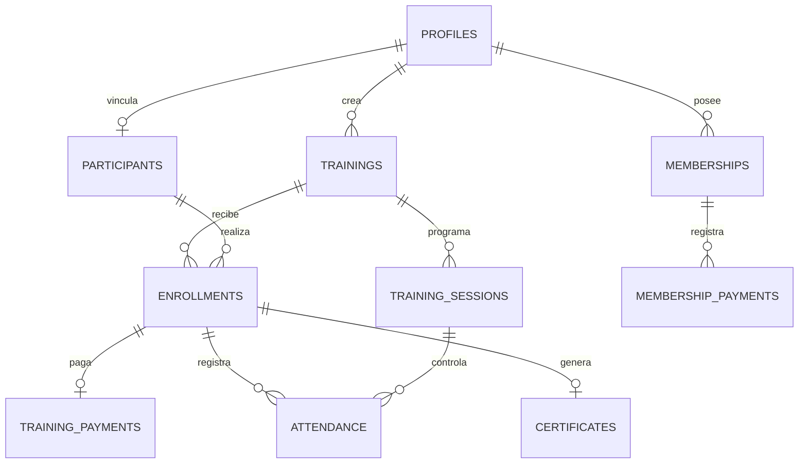

# Complemento para levantar las observaciones del SCRUM

El Word de observaciones contiene como objeto incrustado el archivo `Modelo SCRUM.pdf`. Se extrajo sin modificarlo y quedó en:

`docs/referencias/Modelo_SCRUM_extraido_desde_Word.pdf`

No se recibió el **SCRUM actual/editable del proyecto SPAE**, por lo que no es seguro inventar su contenido ni sus números de página. Cuando se entregue ese archivo, debe reordenarse usando como referencia la siguiente estructura del modelo:

1. Product Backlog
2. Product Backlog priorizado
3. Planificación de lanzamiento
4. Historias de usuario
5. Tareas por historia de usuario
6. Cronograma del Sprint
7. Sprint 1
   - Análisis de requerimientos Sprint 1
   - Funcionalidades del primer Sprint
   - Diseño del primer Sprint
   - Entidades del primer Sprint
   - Diagrama lógico del primer Sprint
   - Diagrama físico del primer Sprint
   - Implementación del primer Sprint
   - Pruebas de caja negra del primer Sprint
   - Actas de planificación y revisión del Sprint 1
8. Sprint 2: repetir análisis, funcionalidades, diseño, entidades, DER, diagrama lógico, diagrama físico, implementación, pruebas y actas.
9. Sprint 3: repetir la misma estructura.
10. Sprint 4: repetir la misma estructura.

## Entidades reales del sistema SPAE para el gráfico físico

El esquema entregado usa PostgreSQL/Supabase. Las tablas principales que deben aparecer en el diagrama físico son:

- `profiles`
- `trainings`
- `training_sessions`
- `participants`
- `enrollments`
- `training_payments`
- `attendance`
- `memberships`
- `membership_payments`
- `certificates`
- `system_settings`
- `audit_logs`
- `api_rate_limits`

Relaciones principales verificadas en `supabase/schema.sql`:

- `profiles.id` -> `auth.users.id`
- `training_sessions.training_id` -> `trainings.id`
- `participants.profile_id` -> `profiles.id`
- `enrollments.training_id` -> `trainings.id`
- `enrollments.participant_id` -> `participants.id`
- `training_payments.enrollment_id` -> `enrollments.id`
- `attendance.session_id` -> `training_sessions.id`
- `attendance.enrollment_id` -> `enrollments.id`
- `memberships.profile_id` -> `profiles.id`
- `membership_payments.membership_id` -> `memberships.id`
- `certificates.enrollment_id` -> `enrollments.id`

## Esquema para generar un gráfico de base de datos

Para el documento final, conviene insertar además la captura/exportación del diagrama físico obtenida directamente desde la herramienta de base de datos utilizada en el proyecto, de forma que coincida con los nombres, tipos, PK y FK reales.

## Plantilla de acta por Sprint

### Acta de planificación

- Proyecto: Sistema SPAE
- Sprint: ___
- Fecha: ___
- Objetivo del Sprint: ___
- Historias de usuario comprometidas: ___
- Tareas principales: ___
- Responsable(s): ___
- Duración: ___
- Acuerdos: ___
- Firma y sello: insertar la firma proporcionada en el documento de observaciones.

### Acta de revisión

- Proyecto: Sistema SPAE
- Sprint: ___
- Fecha: ___
- Objetivo revisado: ___
- Funcionalidades terminadas: ___
- Evidencias/pruebas: ___
- Observaciones encontradas: ___
- Acciones de mejora / pendientes: ___
- Resultado de la revisión: ___
- Firma y sello: insertar la firma proporcionada en el documento de observaciones.

Estas plantillas son un apoyo. Deben completarse con datos reales del proyecto y luego insertarse en el SCRUM editable en las secciones correspondientes.
